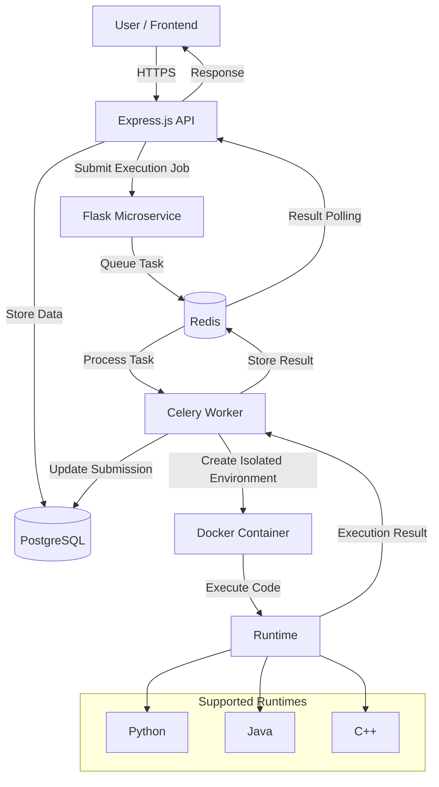

# Online Judge Platform 🏆

A comprehensive online competitive programming platform built with a modern microservices architecture, featuring automated code execution, containerized runtimes, real-time submission results, contests, and scalable background workers.

## 🎥 Demo
https://private-user-images.githubusercontent.com/175551506/634070612-4d1bf1d7-d6e5-4658-b608-58bfb94dd4a3.mp4?jwt=eyJ0eXAiOiJKV1QiLCJhbGciOiJIUzI1NiJ9.eyJpc3MiOiJnaXRodWIuY29tIiwiYXVkIjoicmF3LmdpdGh1YnVzZXJjb250ZW50LmNvbSIsImtleSI6ImtleTUiLCJleHAiOjE3ODY0MjkzNDgsIm5iZiI6MTc4NjQyOTA0OCwicGF0aCI6Ii8xNzU1NTE1MDYvNjM0MDcwNjEyLTRkMWJmMWQ3LWQ2ZTUtNDY1OC1iNjA4LTU4YmZiOTRkZDRhMy5tcDQ_WC1BbXotQWxnb3JpdGhtPUFXUzQtSE1BQy1TSEEyNTYmWC1BbXotQ3JlZGVudGlhbD1BS0lBVkNPRFlMU0E1M1BRSzRaQSUyRjIwMjYwODExJTJGdXMtZWFzdC0xJTJGczMlMkZhd3M0X3JlcXVlc3QmWC1BbXotRGF0ZT0yMDI2MDgxMVQwNjE3MjhaJlgtQW16LUV4cGlyZXM9MzAwJlgtQW16LVNpZ25hdHVyZT03NGFjYmQ1M2UwMTk0ZjQ2NDExNmQ4YzYzZjNhYzlkZmZiZGI5OTY4N2M5NTYxZWY3ZmMzNjk5YzAwNDgzNWUyJlgtQW16LVNpZ25lZEhlYWRlcnM9aG9zdCZyZXNwb25zZS1jb250ZW50LXR5cGU9dmlkZW8lMkZtcDQifQ.F9x1BL4DjwIG4xISWIK-Gfxd4Z_kHaWheaswipbMLTQ

---

## 🌟 Platform Highlights

* 🚀 **Online Code Execution** - Submit and execute solutions in multiple programming languages.
* 🏗️ **Microservices Architecture** - Separates API handling, task queuing, and code execution.
* 🐳 **Containerized Execution** - Runs submitted code inside isolated Docker containers.
* ⚡ **Real-Time Results** - Provides submission status and execution results.
* 🏆 **Competitive Programming** - Supports problems, submissions, contests, and leaderboards.
* 👥 **Team Competitions** - Supports collaborative/team-based contests.
* 🔐 **Secure Authentication** - JWT-based authentication and authorization.
* 📈 **Scalable Execution** - Background workers allow multiple submissions to be processed concurrently.

---

## 🛠️ Technology Stack

<div align="center">


</div>

### Backend

* **Node.js + Express.js** - Main API server handling authentication, problems, contests, and submissions.
* **Flask** - Microservice responsible for receiving and queuing execution requests.
* **Celery** - Distributed task queue used to process code execution jobs.
* **PostgreSQL** - Persistent storage for users, problems, contests, and submissions.
* **Redis** - Message broker and result/cache storage.

### DevOps & Infrastructure

* **Docker & Docker Compose** - Containerization and multi-service orchestration.
* **Google Cloud Platform** - Application hosting.
* **Let's Encrypt** - SSL certificates.
* **GoDaddy** - Domain/DNS management.

---

## 🏗️ System Architecture


---

## ✨ Features

### 👤 User Management

* User registration
* User authentication
* JWT-based authorization
* Profile management
* User-specific submissions

### 🧩 Problem Management

* Browse programming problems
* Create problems
* Edit problems
* Delete problems
* Organize programming challenges
* Test solutions against predefined test cases

### 💻 Multi-Language Code Execution

The platform supports execution in multiple programming languages, including:

* C++
* Python
* Java

Each submission is executed in an isolated runtime environment.

### ⚡ Online Judge

The judging system evaluates submitted solutions against test cases and determines the final result.

Supported outcomes include:

* ✅ Accepted
* ❌ Wrong Answer
* ⚠️ Runtime Error
* ⏱️ Time Limit Exceeded
* 🔴 Compilation Error

### 🏆 Contests

* Contest creation
* Contest participation
* Contest problems
* Submission tracking
* Live standings
* Leaderboards

### 👥 Team Competitions

The platform also supports team-based competitive programming contests, allowing multiple users to participate collaboratively.

### 📊 Leaderboards

Dynamic leaderboards provide rankings based on contest performance and submissions.

### 🔐 Security

* JWT authentication
* Role-based authorization
* Password hashing
* Isolated code execution
* Docker-based sandboxing
* Resource restrictions
* HTTPS communication

---

## 🐳 Docker Architecture

The application is composed of multiple services.

```text
                 ┌──────────────────┐
                 │    Frontend      │
                 └────────┬─────────┘
                          │
                          ▼
                 ┌──────────────────┐
                 │  Express API     │
                 └───────┬──────────┘
                         │
              ┌──────────┴──────────┐
              ▼                     ▼
       ┌──────────────┐      ┌──────────────┐
       │ PostgreSQL   │      │    Flask     │
       └──────────────┘      └──────┬───────┘
                                    │
                                    ▼
                              ┌────────────┐
                              │   Redis    │
                              └─────┬──────┘
                                    │
                                    ▼
                              ┌────────────┐
                              │   Celery   │
                              │   Worker   │
                              └─────┬──────┘
                                    │
                                    ▼
                            ┌─────────────────┐
                            │ Docker Sandbox  │
                            │                 │
                            │ C++ / Java /    │
                            │ Python          │
                            └─────────────────┘
```

Scaling the workers allows multiple code execution jobs to be processed concurrently.

---

## 🔐 Code Execution Security

Running arbitrary user-submitted code is one of the most important challenges in an online judge.

The platform addresses this using Docker-based isolation.

Each submission is executed inside a separate container, preventing the submitted program from directly interacting with the host environment.

The execution environment can enforce:

* CPU limits
* Memory limits
* Execution time limits
* Filesystem restrictions
* Network restrictions
* Container cleanup after execution

This provides a safer execution environment for untrusted user code.

---

## 📊 Scalability

The asynchronous execution architecture allows the platform to handle multiple submissions without blocking the main API server.

Instead of executing code directly inside the API process:

```text
User
 │
 ▼
API Server
 │
 ▼
Queue
 │
 ├── Worker 1
 ├── Worker 2
 ├── Worker 3
 └── Worker N
```

Additional workers can be added as submission traffic increases.

This provides horizontal scalability for the compute-intensive code execution layer.

---

## 🗄️ Data Storage

PostgreSQL is used as the primary persistent database.

It stores information such as:

* Users
* Problems
* Test cases
* Contests
* Teams
* Submissions
* Submission results
* Contest standings

Redis is used for:

* Task queuing
* Temporary execution results
* Fast result retrieval
* Communication between execution components

---

## 📈 Performance Considerations

The architecture separates request handling from code execution.

This prevents long-running submissions from blocking the API server.

Key performance techniques include:

* Asynchronous task processing
* Redis-based queues
* Multiple Celery workers
* Database indexing
* Containerized execution
* Result caching
* Horizontal worker scaling

---

## 🧠 Key Engineering Challenges

### 1. Running Untrusted Code

The platform needs to execute arbitrary user programs without compromising the host machine.

**Solution:** Docker-based isolated execution environments with resource restrictions.

### 2. Long-Running Submissions

Code execution can take significantly longer than normal API requests.

**Solution:** Move execution into asynchronous Celery workers.

### 3. Concurrent Submissions

Multiple users may submit code simultaneously.

**Solution:** Redis-backed task queues and horizontally scalable workers.

### 4. Reliable Result Retrieval

The API should remain responsive while workers execute submissions.

**Solution:** Store execution state/results separately and retrieve them asynchronously.

### 5. Deployment

The project contains multiple independent services.

**Solution:** Docker Compose for orchestration and GitHub Actions for automated deployment.

---

## 📁 High-Level Architecture

```text
my-online-judge/
│
├── backend/
│   ├── controllers/
│   ├── routes/
│   ├── models/
│   ├── middleware/
│   └── services/
│
├── frontend/
│
├── flask-service/
│
├── worker/
│
├── docker/
│
├── docker-compose.yml
├── .env.example
└── README.md
```

> Adjust the directory structure above if your actual repository structure differs.

---
## 📚 Inspiration

The project takes inspiration from competitive programming platforms such as:

* Codeforces
* LeetCode
* AtCoder
* HackerRank

The goal is to combine a competitive programming interface with a scalable backend capable of safely executing untrusted code.

---

## 👨‍💻 Author

**Maitreya Vaidya**

GitHub: [@maitreya-16](https://github.com/maitreya-16)

---

## ⭐ Support

If you found this project interesting, consider giving the repository a ⭐.

[⭐ Star the Repository](https://github.com/maitreya-16/my-online-judge)

---

<div align="center">

### Built with ❤️ and a lot of code

**Online Judge Platform**

</div>
